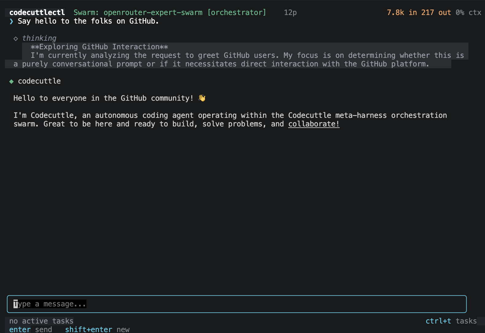

# codecuttlectl

`codecuttlectl` (`c3`) is an autonomous CLI coding agent and meta-harness built in Go. It wraps foundation models with decoupled gRPC tool execution, real-time diagnostic feedback loops, declarative multi-agent swarm morphologies, and monotonic context caching.



## Highlights

- **Swarm Morphologies & Parallel Backlog:** Coordinate multi-agent topologies (e.g. planner, coder, reviewer) via declarative YAML definitions. Headless worker pools execute background tasks concurrently with live progress reporting in the TUI.
- **Cuttlebone Substrate (Decoupled Plugins):** Tools run as isolated gRPC subprocesses with type-safe Go struct validation, crash recovery, and runtime plugin scaffolding (`scaffold_plugin`).
- **Universal Multi-Provider Support:** First-class streaming, prompt caching, reasoning extraction, and retry resilience across **AWS Bedrock**, **OpenRouter**, **Google AI (Gemini)**, and **Ollama (local)**.
- **Inkwell Diagnostic Engine:** Real-time error classification and trace analysis. Automatically injects context-specific remediation skills when build, test, or tool errors occur.
- **Monotonic Extension Caching:** 3-tier prompt caching (tools, system prompt, conversation history) to reduce API latency and cost by up to 90%.

---

## Installation

```bash
# Clone and build binary + plugins
git clone https://github.com/Modzybear/codecuttlectl.git
cd codecuttlectl
make all

# Install system-wide (or symlink into PATH)
sudo cp bin/codecuttlectl /usr/local/bin/codecuttlectl
sudo mkdir -p /usr/local/lib/codecuttlectl/plugins
sudo cp bin/plugins/* /usr/local/lib/codecuttlectl/plugins/

# Convenience alias
echo 'alias c3="codecuttlectl -plugin-dir /usr/local/lib/codecuttlectl/plugins"' >> ~/.bashrc
source ~/.bashrc
```

---

## Quickstart

```bash
# Interactive TUI (default provider: Bedrock Claude 3.7 / 4.6)
c3

# Multi-Agent Swarm Mode (declarative morphology)
c3 --morphology testdata/openrouter-astra-swarm.yaml

# Local Models via Ollama (auto-detected prefix or explicit flag)
c3 --model ollama:qwen3:32b
c3 --provider ollama --model gemma4:31b

# OpenRouter / Google Gemini
c3 --provider openrouter --model anthropic/claude-3.7-sonnet
c3 --provider google --model gemini-2.5-pro

# Non-interactive / Scripting / Resume
c3 -message "Fix compile errors in ./internal/provider"
c3 -no-tui                      # Pure streaming REPL
c3 --list-sessions              # View saved sessions and token costs
c3 --session ses_abc123         # Resume previous session state
```

---

## Supported Providers

| Provider | Flag / Prefix | Example Models | Caching & Cost Tracking |
|:---|:---|:---|:---|
| **AWS Bedrock** *(default)* | `--provider bedrock` | Claude Opus 4.6, Claude Sonnet 3.7 | 3-tier checkpoint extension caching |
| **OpenRouter** | `--provider openrouter` | Claude 3.7, DeepSeek V3/R1, Qwen 2.5 | Automatic 429 retry + backoff countdown |
| **Google AI** | `--provider google` | Gemini 2.5 Pro, Gemini 2.5 Flash | Context caching with custom token threshold |
| **Ollama** | `--provider ollama` | `ollama:qwen3:32b`, `ollama:gemma4:31b` | Local inference, zero API cost |

---

## Architecture & Morphologies

Named after cephalopod neurology where peripheral arm clusters solve problems locally. The orchestrator delegates tool execution to independent plugin processes and routes complex problems across specialized swarm agents.

```
                  ┌─────────────────────────────────────────┐
                  │          codecuttlectl Engine           │
                  │   (Sessions, History, Context Cache)    │
                  └───────────────────┬─────────────────────┘
                                      │
              ┌───────────────────────┼───────────────────────┐
              ▼                       ▼                       ▼
    ┌───────────────────┐   ┌───────────────────┐   ┌───────────────────┐
    │  Primary / Astra  │◄─►│    Deep Coder     │◄─►│   Qwen Reviewer   │
    │   (Coordinator)   │   │  (Implementation) │   │  (Code Reviewer)  │
    └─────────┬─────────┘   └─────────┬─────────┘   └─────────┬─────────┘
              │                       │                       │
              └───────────────────────┼───────────────────────┘
                                      ▼
                        ┌───────────────────────────┐
                        │   Cuttlebone gRPC Layer   │
                        │ (read, write, bash, git…) │
                        └───────────────────────────┘
```

### Core Subsystems

- **Swarm Orchestration:** Dynamic multi-agent routing defined in concise YAML morphologies. Agents transition context cleanly with automated cross-provider history sanitization.
- **Swarm Backlog:** Proactive task decomposition (`todo_manage`) distributing independent coding slices asynchronously across parallel background agents.
- **Inkwell & Skills Registry:** Captures tool outcomes and failure patterns. Injects targeted instructions and workflows only when relevant to the active context.
- **Context Compaction:** Heuristic summarization of long tool results keeping active context windows lean.

---

## Built-in & Plugin Tools

`codecuttlectl` includes 17 tools out of the box (12 modular gRPC plugins + 5 harness built-ins):

- **Filesystem & Shell:** `read_file`, `write_file`, `edit_file`, `list_directory`, `glob`, `grep`, `bash_exec`
- **Version Control & GitHub:** `git` (with destructive command safeguards), `github` (PRs, issues, comments, releases)
- **Web & Research:** `websearch` (Exa search integration), `webfetch` (HTML to markdown/text extraction)
- **Harness & Extensibility:** `todo_manage`, `tool_info`, `get_skill`, `go_skills`, `scaffold_plugin`, `reload_plugins`

---

## Developing Plugins

Plugins are standalone executables communicating over gRPC using the Cuttlebone protocol. To create a new plugin in Go:

```go
type SearchInput struct {
    Query string        `json:"query" jsonschema:"required" jsonschema_description:"Search query"`
    Limit types.FlexInt `json:"limit,omitempty" jsonschema_description:"Max results to return"`
}

// Scaffold instantly during any session:
// scaffold_plugin(name="cuttlebone-mytool", description="Custom tool")
```

See [`docs/writing-plugins.md`](docs/writing-plugins.md) for full plugin and skill creation guides.

---

## Development

```bash
make all      # Compile binary and all plugins
make test     # Run all package unit tests
make validate # Full test pass (unit, race detector, vet, and offline TUI tests)
```

## License

See [LICENSE](LICENSE).
